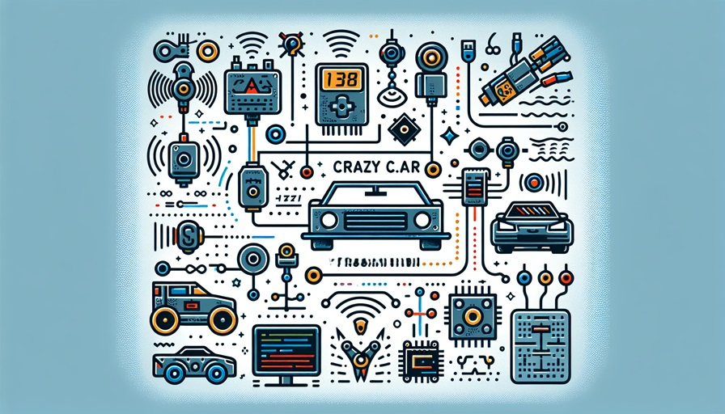
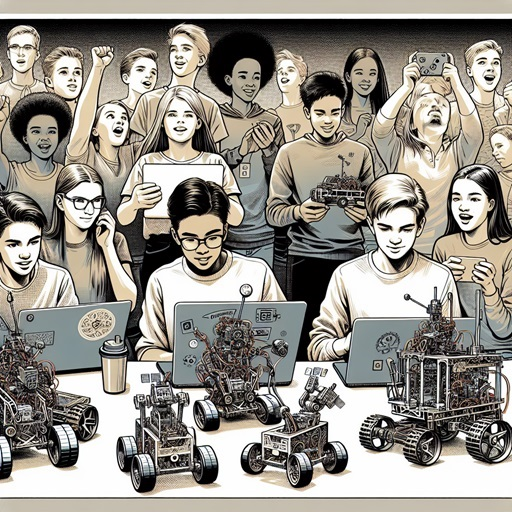
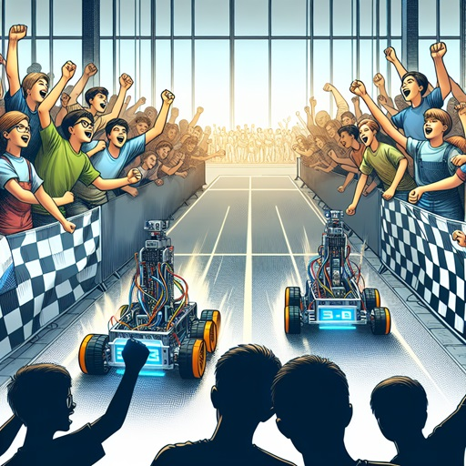
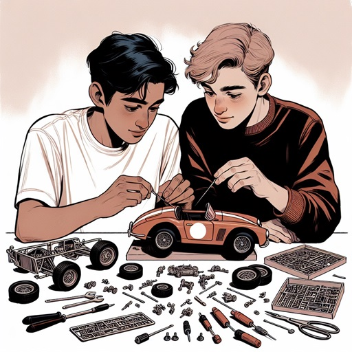
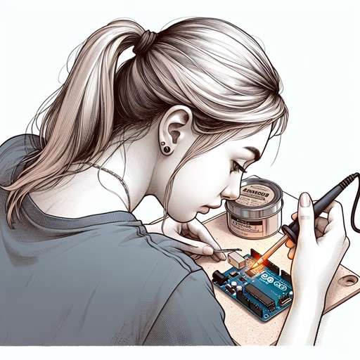
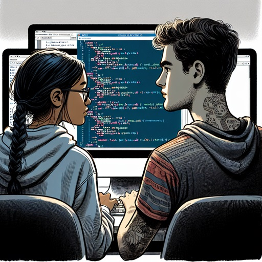
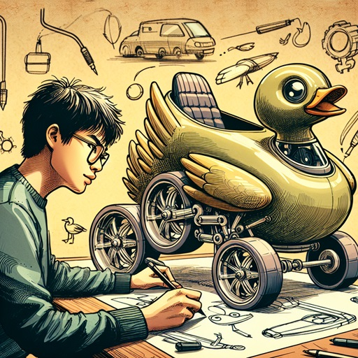
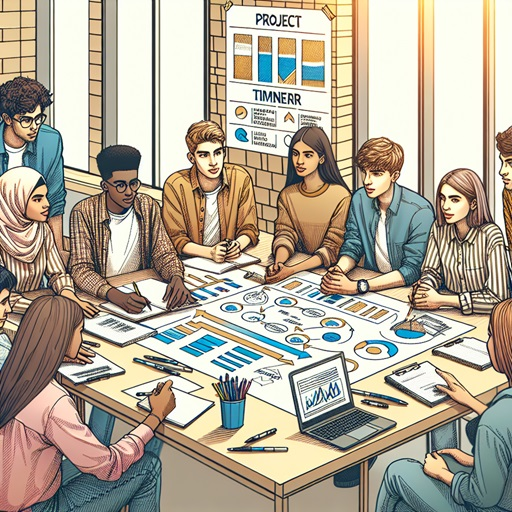

Im Projekt Crazy Car können Jugendliche Kreativität mit Spaß und Technik verbinden. In Teams werden ferngesteuerte Modellautos zu selbstfahrenden Modellen umgebaut.

Im Sommer jeden Jahres findet ein CrazyCar-Cup statt, bei dem die Teams in den Disziplinen Crazy Race und Show & Shine gegeneinander antreten.

# Teilnehmen können Schulklassen, die jeweils in vierköpfigen Teams aufgeteilt werden.
Wir starten das Projekt jährlich im September und begleiten Euch bei der Entwicklung durch das Schuljahr. 

Lehrmaterial und Anleitungen werden im eigenen [Wiki](https://github.com/FHW-Appel/CrazyCar/wiki) bereitgestellt.

## Folgende Herausforderungen sind zu bewältigen:
### Mechanik: 

Aufbau eines Modellautos mit über hundert Einzelteilen inklusive Differentialgetriebe und Lenkgestänge.

### Elektronik: 

Löten, Vermessen und Inbetriebnahme der Steuerungsplatine.

### Programmierung:

Programmierung zu einem autonomen Fahrzeug.

### Design: 

Umbau des Fahrzeuges zu einem einzigartigen wie funktionalen Design.

### Projektplanung: 

Organisation und Koordination der Teamaufgaben.

> [!NOTE]
> Bei den gezeigten Bildern handelt es sich um KI-generiertes Bildmaterial. Um die persönlichkeitsrechte der teilnehmenden Schüler und Schülerinnen zu waren, werden auf dieser Webseite keine Fotos von Schülern und Schülerinnen veröffentlicht.